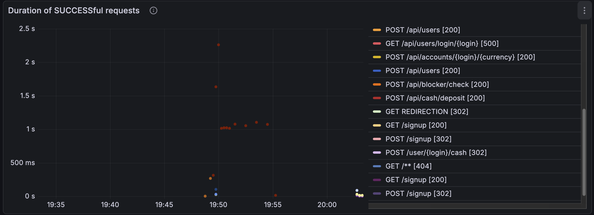
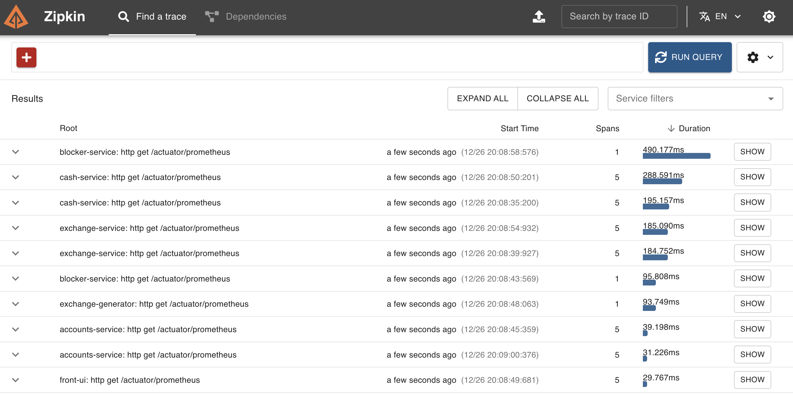
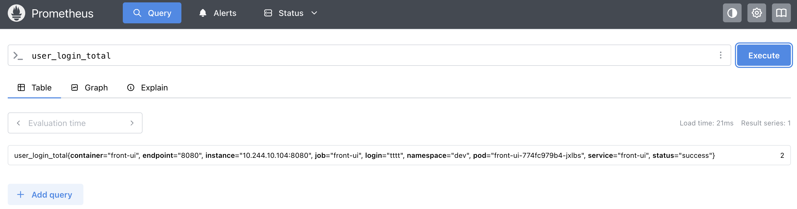

# Bank Application — Sprint 12

Микросервисное приложение «Банк» с реализованными трейсингом, мониторингом, алертами и централизованным логированием.

Проект доработан в рамках двенадцатого спринта.

---

## Реализовано

### Трейсинг (Zipkin)
- Zipkin развёрнут в Kubernetes с использованием Helm
- Используется Micrometer Tracing (Brave)
- Трейсируются:
    - входящие и исходящие HTTP-запросы
    - обращения к БД
    - взаимодействие с Apache Kafka
- TraceId и SpanId передаются между сервисами и логируются

---

### Метрики и алерты (Prometheus + Grafana)
- Prometheus развёрнут через `kube-prometheus-stack`
- Метрики поставляются через Spring Boot Actuator и Micrometer
- Собираются:
    - HTTP-метрики
    - JVM-метрики
- Grafana подключена к Prometheus
- Настроены дашборды:
    - HTTP-метрики
    - JVM-метрики

    - 

---

### Логирование (Kafka + ELK)
- Все микросервисы отправляют логи в общий Kafka-топик `logs`
- Используется Slf4j + Logback / Log4j2
- Logstash читает логи из Kafka и отправляет их в Elasticsearch
- Kibana используется для визуализации и анализа логов
- Логи содержат `traceId` и `spanId` для корреляции с Zipkin

---

## Развёртывание

- Все компоненты разворачиваются в Kubernetes с помощью Helm
- CI/CD реализован через Jenkins (`Jenkinsfile`)
- Pipeline:
    - разворачивает Kafka, Zipkin, Prometheus, Grafana и ELK
    - собирает микросервисы
    - деплоит микросервисы в Kubernetes

---